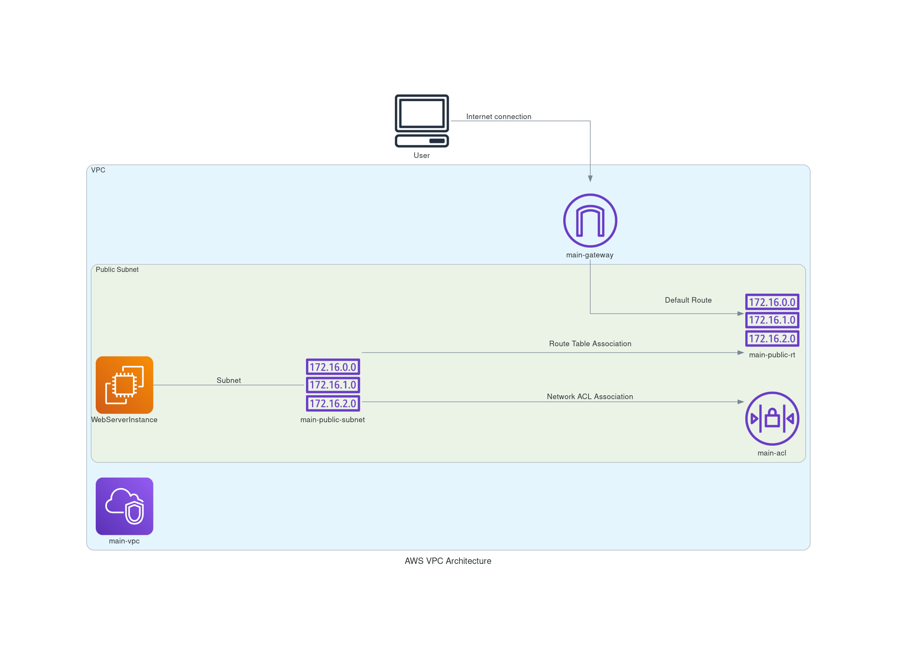

# Building the AWS Infrastructure with Terraform (VPC, IG, SG, NACL)

This project demonstrates how to use Terraform to create a basic AWS infrastructure, including a VPC, Subnet, Internet Gateway, Route Table, Security Group, Network ACL, and an EC2 instance. I also learned how to generate a visual architecture diagram using the diagrams library in Python. Despite some challenges with imports and layout adjustments, I successfully created a compact and informative diagram.

## Generating the Architecture Diagram

Creating a visual representation of your infrastructure is essential for understanding and communicating your setup. For this project, we used the diagrams library in Python to generate an architecture diagram based on our Terraform configuration.

### Step-by-Step Guide to Generate the Architecture Diagram

**1. Install the diagrams library:**

Ensure you have Python installed, then install the diagrams library using pip:

```py
    pip install diagrams
```

**2. Write the Python script:**

Create a Python script (e.g., aws_architecture.py) with the following code:

```py
    from diagrams import Diagram, Cluster, Edge
    from diagrams.aws.network import VPC, InternetGateway, RouteTable, Nacl
    from diagrams.aws.compute import EC2
    from diagrams.aws.general import User, Client

graph_attr = {
    "splines": "ortho",
    "nodesep": "0.5",
    "ranksep": "0.75",
}

with Diagram("AWS VPC Architecture", show=False, graph_attr=graph_attr):
    user = Client("User")

    with Cluster("VPC"):
        vpc = VPC("main-vpc")

        igw = InternetGateway("main-gateway")
        user >> Edge(label="Internet connection") >> igw

        with Cluster("Public Subnet"):
            subnet = RouteTable("main-public-subnet")  # Using RouteTable to represent Subnet

            route_table = RouteTable("main-public-rt")
            subnet >> Edge(label="Route Table Association") >> route_table
            igw >> Edge(label="Default Route") >> route_table

            nacl = Nacl("main-acl")
            subnet >> Edge(label="Network ACL Association") >> nacl

            ec2 = EC2("WebServerInstance")
            ec2 - Edge(label="Subnet") - subnet

```




**3. Run the Python script:**

Execute the script to generate the diagram:

```py
    python3 aws_architecture.py

```

## Step-by-Step Guide

### Explanation

- VPC: A Virtual Private Cloud to host your resources.
- Internet Gateway: Allows internet access to your VPC.
- Public Subnet: A subnet within the VPC for hosting public resources.
- Route Table: Defines routing rules for the subnet.
- Network ACL (NACL): Adds an additional layer of security to control inbound and outbound traffic atthe subnet level.
- Security Group: Defines firewall rules for the EC2 instance.
- EC2 Instance: A virtual server to run applications.

Now, let's dive into the step-by-step guide to building the AWS infrastructure using Terraform.

**Prerequisites**

1. AWS Account: Make sure you have an AWS account.

2. Terraform Installed: Install Terraform on your local machine. Follow the [official installation guide](https://developer.hashicorp.com/terraform/install).

### Step 1: Set Up Your Terraform Configuration

Create a new directory for your project and navigate to it:

```sh
    mkdir my-aws-project
    cd my-aws-project
```

Create a file named main.tf and add the following Terraform configuration:

```hcl
    provider "aws" {
  region = "us-east-1"
}

resource "aws_vpc" "main" {
  cidr_block           = "10.0.0.0/16"
  enable_dns_support   = true
  enable_dns_hostnames = true

  tags = {
    Name = "main-vpc"
  }
}

resource "aws_internet_gateway" "gw" {
  vpc_id = aws_vpc.main.id

  tags = {
    Name = "main-gateway"
  }
}

resource "aws_subnet" "public" {
  vpc_id            = aws_vpc.main.id
  cidr_block        = "10.0.1.0/24"
  map_public_ip_on_launch = true

  tags = {
    Name = "main-public-subnet"
  }
}

resource "aws_route_table" "public" {
  vpc_id = aws_vpc.main.id

  tags = {
    Name = "main-public-rt"
  }
}

resource "aws_route" "default_route" {
  route_table_id         = aws_route_table.public.id
  destination_cidr_block = "0.0.0.0/0"
  gateway_id             = aws_internet_gateway.gw.id
}

resource "aws_route_table_association" "a" {
  subnet_id      = aws_subnet.public.id
  route_table_id = aws_route_table.public.id
}

resource "aws_security_group" "allow_ssh_http" {
  vpc_id = aws_vpc.main.id

  ingress {
    from_port   = 22
    to_port     = 22
    protocol    = "tcp"
    cidr_blocks = ["0.0.0.0/0"]
  }

  ingress {
    from_port   = 80
    to_port     = 80
    protocol    = "tcp"
    cidr_blocks = ["0.0.0.0/0"]
  }

  egress {
    from_port   = 0
    to_port     = 0
    protocol    = "-1"
    cidr_blocks = ["0.0.0.0/0"]
  }

  tags = {
    Name = "allow_ssh_http"
  }
}

resource "aws_network_acl" "main" {
  vpc_id = aws_vpc.main.id

  tags = {
    Name = "main-acl"
  }
}

resource "aws_network_acl_rule" "allow_all_inbound" {
  network_acl_id = aws_network_acl.main.id
  rule_number    = 100
  egress         = false
  protocol       = "-1"
  rule_action    = "allow"
  cidr_block     = "0.0.0.0/0"
}

resource "aws_network_acl_rule" "allow_all_outbound" {
  network_acl_id = aws_network_acl.main.id
  rule_number    = 100
  egress         = true
  protocol       = "-1"
  rule_action    = "allow"
  cidr_block     = "0.0.0.0/0"
}

resource "aws_network_acl_association" "a" {
  subnet_id     = aws_subnet.public.id
  network_acl_id = aws_network_acl.main.id
}

resource "aws_instance" "web" {
  ami           = data.aws_ami.latest.id
  instance_type = "t2.micro"
  subnet_id     = aws_subnet.public.id
  vpc_security_group_ids = [aws_security_group.allow_ssh_http.id]
  key_name = "dev-env-key"

  tags = {
    Name = "WebServerInstance"
  }
}

data "aws_ami" "latest" {
  most_recent = true
  owners      = ["amazon"]

  filter {
    name   = "name"
    values = ["amzn2-ami-hvm-*-x86_64-gp2"]
  }
}

```

### Step 2: Initialize Terraform

Initialize your Terraform configuration by running:

```py
    terraform init
```

This command downloads the necessary provider plugins and sets up your Terraform working directory.

### Step 3: Apply the Terraform Configuration

To create the infrastructure, run:

```hcl
    terraform apply
```

Terraform will show you an execution plan and ask for your confirmation. Type **yes** to proceed. Terraform will then create the resources as defined in your configuration.

### Step 4: Verify the Infrastructure

Once Terraform has finished applying the configuration, log in to your AWS Management Console and navigate to the VPC, Subnets, and EC2 sections to verify that the resources have been created as expected.

### Step 5: Clean Up

When you're done with the project, you can clean up the resources by running:

```hcl
    terraform destroy
```

Again, Terraform will show you a plan and ask for your confirmation. Type **yes** to proceed, and Terraform will delete all the resources it created.

## Challenges Faced

Import Errors: Initially, there were import errors with specific AWS components like Subnet and SecurityGroup. To resolve this, I researched and used more generic components available in the diagrams library.
Compact Layout: Adjusting the layout to make the diagram more compact required tweaking the graph_attr parameters, which took some trial and error.